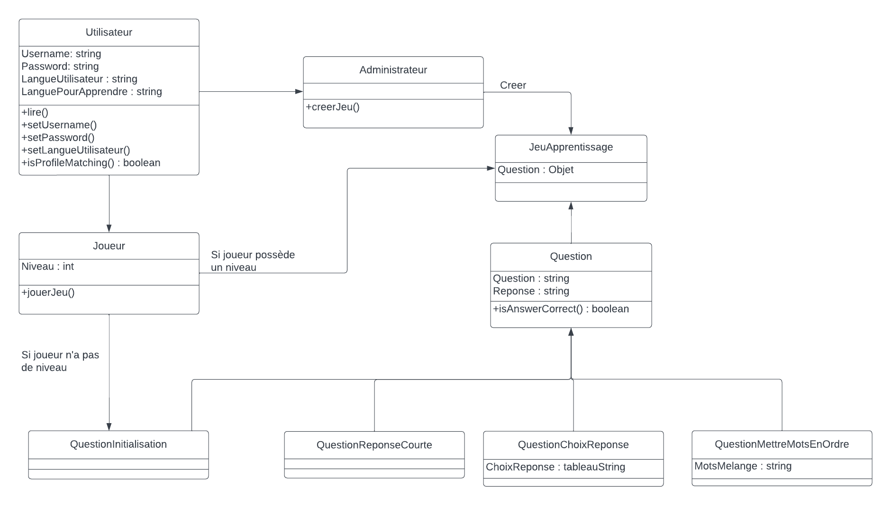
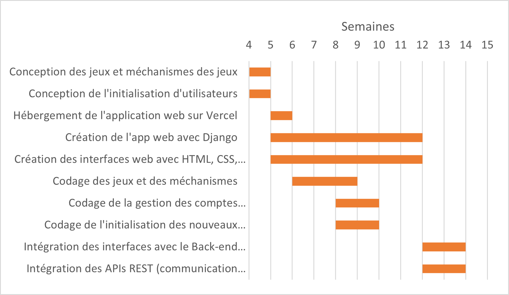

# <a href="https://github.com/fwicotex/ProjetSim204">MotsPassant</a>

## Description

### L'équipe
Karl Rizk, Mohamed Amine M'hammedi, Zineddine Abdel Brahimi, Benjamin Gurlekian, Joseph Keshishian

### L'idée
Application web qui offre la possibilité aux utilisateurs de se connecter à travers Google ou Facebook et qui propose des séries d’exercices interactifs qui leur permettent d’apprendre la langue d’un pays de leur choix avec des repères culturels pour faciliter leur intégration dans ce pays et dans sa culture. Les exercices seront adaptés selon le niveau de langue de l’utilisateur (débutant, intermédiaire, avancé, etc.) et selon son progrès.

### L'utilité
MotsPassant permettra aux utilisateurs d'apprendre une nouvelle langue et de connaitre davantage sur la culture d'un pays au choix en proposant des activités interactives.

### L'innovation
Apprentissage de langues et de cultures à travers des activités interactives à partir d’une application web.

### Cas d'utilisation
#### Diagramme du cas d'utilisation
Notre projet MotsPassant compte quatre domaines principaux :
* La connexion : La connexion via le site web est effectuée par les membres de l'administration et par les utilisateurs habituels ;
* L'administration : L'administration est effectuée par les membres de l'administration via l'interface web ;
* La plateforme de jeu : La plateforme de jeu est accessible par les utilisateurs habituels via l'interface web ;
* L'inscription : L'inscription à travers le site web est effectuée par tous les nouveaux utilisateurs ;
* Les questions d'initiation : Les questions d'initiation sont accessibles aux nouveaux utilisateurs qui sont inscrits à MotsPassant.

Les acteurs principaux sont :
* L'utilisateur habituel ;
* L'administrateur ;
* Le nouvel utilisateur, qui s'inscrira et qui passera par les questions d'initiation pour devenir un utilisateur habituel.

#### Description des acteurs

<table>
  <tr>
    <th>Acteur</th>
    <th>Rôle</th>
  </tr>
  <tr>
    <td>Utilisateur habituel</td>
    <td>Se connecte et utilise la plateforme de jeu pour l'apprentissage.</td>
  </tr>
  <tr>
    <td>Administrateur</td>
    <td>Se connecte et est responsable de la création de des modifications des jeux.</td>
  </tr>
  <tr>
    <td>Nouvel utilisateur</td>
    <td>S'inscrit et passe par des questions d'initiations pour déterminer son niveau de langue.</td>
  </tr>
</table>

#### Description des cas d'utilisation

<table>
  <tr>
    <th>Scénario</th>
    <th>Description</th>
  </tr>
  <tr>
    <td>Saisie de courriel, du nom d'utilisateur et du mot de passe</td>
    <td>Entrer les données pour la création du compte MotsPassant ou se connecter via Facebook ou Google pour créer le compte</td>
  </tr>
  <tr>
    <td>Initialisation en tant qu'utilisateur habituel</td>
    <td>le nouvel utilisateur passe par des questions d'initiation pour que l'application web détermine son niveau de langue afin que les activités proposées soient adaptées à son niveau</td>
    <tr>
    <td>Participer aux jeux d'apprentissage</td>
    <td>L'utilisateur peut sélectionner les séries d'activités pour s'entrainer via les différentes plateformes de jeu</td>
  </tr>
  <tr>
    <td>Création et modification</td>
    <td>L'administrateur peut créer et modifier une plateforme de jeu</td>
  </tr>
  
</table>

### À qui ça s'adresse
MotsPassant est un outil qui bénéfice les utilisateurs qui souhaitent apprendre une nouvelle langue et qui souhaitent découvrir de nouvelles cultures et s'intégrer dans des sociétés étrangères.

### Lien avec les autres matières
Lien avec les cours de français, anglais et autres langues apprises.

## Technologies
Pour ce qui est des technologies utilisées, nous allons naviguer avec celles-ci en les regroupant de manière cohérente.

### Technologies à utiliser
Premièrement, nous avons les langages de programmation. Nous avons choisi d’utiliser JavaScript, HTML et CSS, des choix populaires et fiables pour coder la partie frontale (frontend) d'une application web, ainsi que Python et Python Django pour le codage de la partie backend de notre application. D’une part, JavaScript est un langage de programmation qui permet l'interaction dynamique avec l'utilisateur. HTML quant à lui, fournit la structure de base de la page web, tandis que CSS est utilisé pour la mise en forme et la présentation. D’autre part, nous avons choisi Python pour le backend, car c’est un langage de programmation extrêmement polyvalent, ainsi que Django, un Framework web de Python, qui offre une large gamme de fonctionnalités pour la création d'applications web complexes.

En ce qui concerne les Framework supplémentaires utilisés, nous avons donc le framework JavaScript React, le framework HTML Bootstrap et le framework CSS Materialize. React nous permet de construire des interfaces utilisateur interactives en utilisant une approche basée sur des composants, il utilise également un DOM virtuel pour améliorer les performances en minimisant les mises à jour de l'interface utilisateur. Bootstrap de son côté, c’est un framework HTML qui facilite la création de pages web esthétiquement agréables en utilisant des classes CSS pré-écrites. Materialize est un framework CSS qui permet la création de pages web esthétiquement agréables en utilisant des classes CSS pré-écrites et des effets visuels interactifs.

Nous planifions d'utiliser les APIs REST (Representational State Transfer). Ces APIs permettent au back-end de communiquer avec le front-end. Le frontend demandera de l'information à l'aide de requêtes HTTP et le backend répondra en envoyant de l'information de type JSON ou XML (JSON dans notre cas). Finalement, pour faire tout cela, nous allons utiliser le Django Rest Framework afin d'intégrer les APIs REST dans notre projet.

Nous allons aussi avoir besoin d’une plateforme pour héberger notre application. C’est quelque chose auquel nous n’avons pas beaucoup pensé avant de présenter notre projet à l’oral. Grâce à nos camarades de classe, nous avons pu découvrir Vercel, un excellent choix pour l'hébergement de MotsPassant. Vercel est une plateforme d'hébergement cloud qui offre une infrastructure rapide, sécurisée et évolutive pour les applications web modernes. Elle offre également une intégration facile avec les frameworks que nous avons choisis.

Finalement, pour ce qui est des technologies de communication, Github et Discord seront utilisés. La plateforme Github sera utilisée comme à la demande de l’enseignant, pour séparer les tâches, faire des commit, se donner des split, lancer des issues, etc. L’application Discord quant à elle, sera utilisée pour avoir une communication plus naturelle et spontanée entre les membres de l’équipe. Elle nous permet de nous envoyer des messages textes, des photos d’inspiration ou bien même de se contacter via un appel vocal.

### Défis/Difficultés

## Plan de travail

### Diagramme de classes

Les classes du projet seront réparties de même. Les classes joueurs et administrateurs héritent de la classe utilisateur et peuvent interagir avec la classe question de façon différente, et les classes de types de questions héritent la classe questions.

### Diagramme de Gantt
Nous avons réparti les tâches de notre projet au fil du temps accordé selon un diagramme de Gantt qui nous permet de visualiser quand devrions-nous commencer chaque tâche et combien de temps elles devraient nous prendre.

